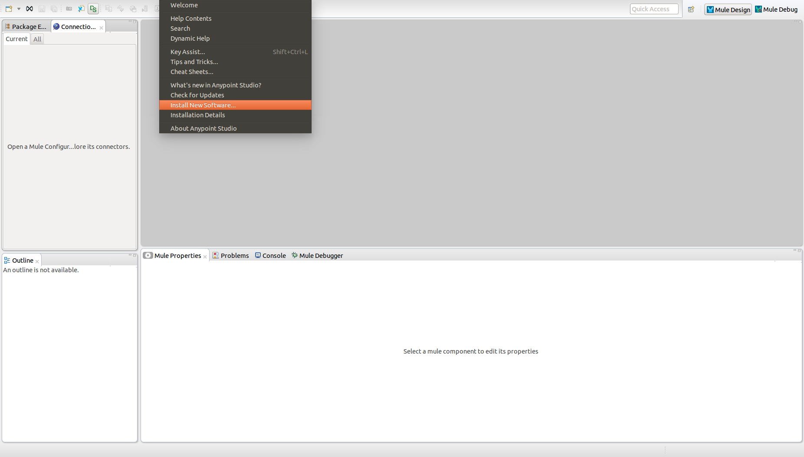
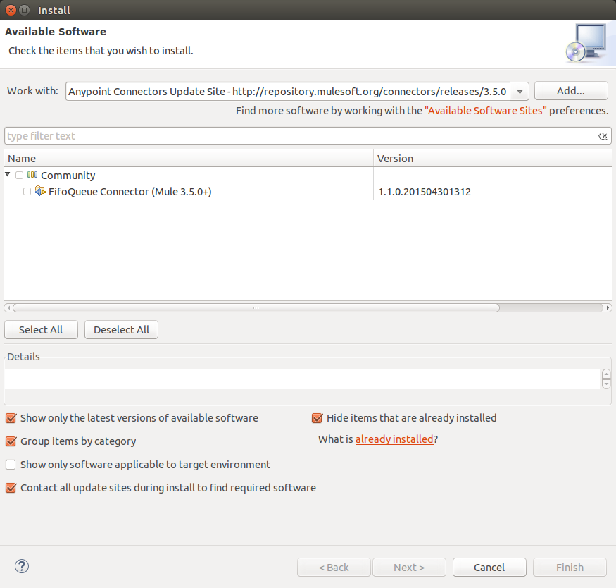
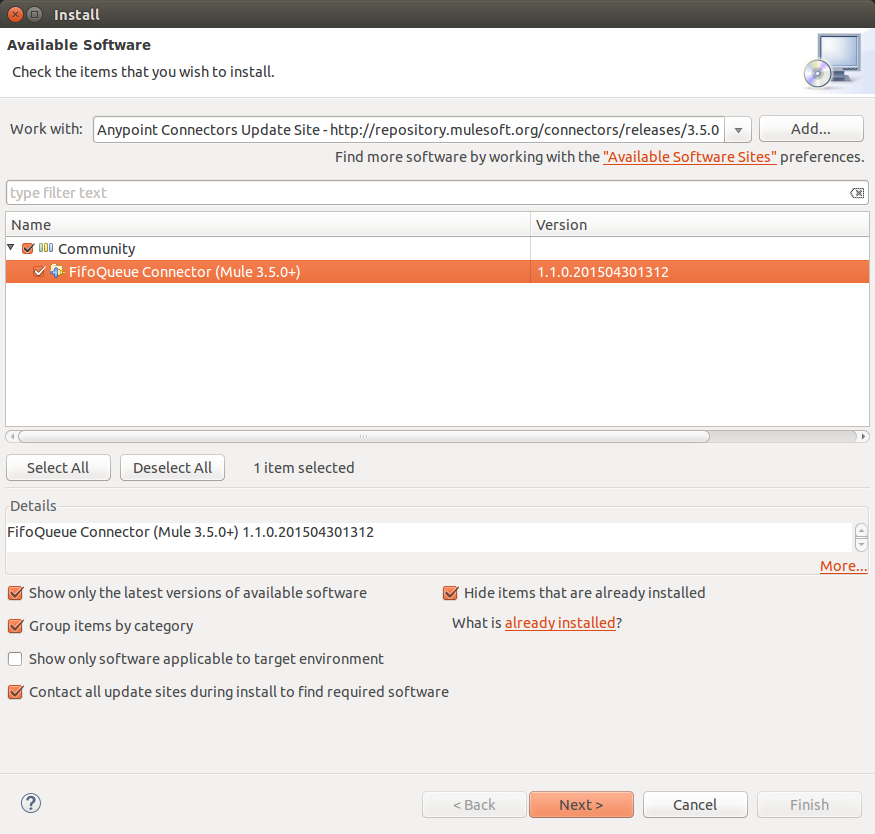
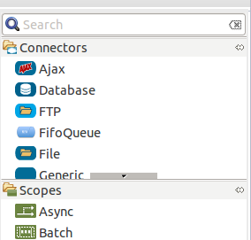

= FIFO Queue Connector

A connector which provides FIFO queues which internally uses the Mule Object Store to store the data. Hence, if the object store is persistent and the application is interrupted, the data will reappear on the queue once it is restarted.

---

== Contents:

. Introduction
.. Prerequisites
.. Requirements
.. Dependencies

. Installing & Configuring
.. Installing
.. Configuring

. See Also

---

== Introduction 

Why use another FIFO queue when Mule provides the VM connector out of the box? The VM connector works brilliantly well, but it does not retain its FIFO feature when used on CloudHub with persistency turned on.

Some use cases need to processed in order, such as processing update messages. Otherwise an older update might overwrite a newer update. If the flow is asynchronous and message loss is not acceptable, this cannot be achieved on CloudHub unless some external transport is used.

=== Prerequisites

This document assumes that you are familiar with Mule, http://www.mulesoft.org/documentation/display/35X/Anypoint+Connectors[Anypoint™ Connectors], and the http://www.mulesoft.org/documentation/display/35X/Anypoint+Studio+Essentials[Anypoint™ Studio interface]. To increase your familiarity with Studio, consider completing one or more http://www.mulesoft.org/documentation/display/35X/Basic+Studio+Tutorial[Anypoint™ Studio Tutorials]. Further, this page assumes that you have a basic understanding of http://www.mulesoft.org/documentation/display/current/Mule+Concepts[Mule flows] and http://www.mulesoft.org/documentation/display/current/Global+Elements[Mule Global Elements]. 

=== Requirements

* http://www.mulesoft.org/documentation/display/current/Hardware+and+Software+Requirements[Hardware and Software Requirements]

=== Dependencies

Supported Mule Runtime Versions: 3.6.x

---

== Installing and Configuring 

=== Installing

You can "test drive" the FIFO Queue connector by installing it on Anypoint™ Studio. Follow the instructions to http://www.mulesoft.org/documentation/display/current/Download+and+Launch+Anypoint+Studio[download and launch Anypoint™ Studio], then follow the steps below to install the connector.

To install the FIFO Queue connector in Anypoint Studio:

. Under the *Help* menu in Anypoint™ Studio, select *Install New Software*.
+

. On the *Install* wizard, click the drop-down arrow for the *Work with:* field, then select the Anypoint™ Connector update site.
+

. In the table below the *Filter* field, click to expand the *Community* folder, and click the check box for *FIFO Queue Connector (Mule 3.5.0+)*. Click *Next*.
+

. In Install Details, click *Next*.
. In Review Licenses, review the license text, and click *I accept the terms of the license agreement*. Click *Finish*. The connector installs.
. At the end of the installation, click *Yes* to restart Anypoint Studio. After Anypoint Studio restarts, the FIFO Queue connector appears in the list of connectors.
+

=== Configuring

To use the FIFO Queue connector, you must configure:

* A global FIFO Queue element for use by all the FIFO Queue connectors in an application.
- _Anypoint™ Studio Visual Editor_
. Click the *Global Elements* tab at the base of the canvas, then click *Create*.
. In the *Choose Global Type* menu, use the filter to locate and select *FIFO Queue*, then click *OK*.
. Configure the parameters according to the table below.
+
|===
|Parameter 						|Description

|*Name*							|Enter a name for the configuration so it can be referenced later.
|*Object Store Reference*		|Enter the object store used to store the queue messages.
|===
+

- _Anypoint™ Studio XML Editor_
+
Create a global FIFO Queue configuration outside and above your flows, using the following global configuration code. Ensure that you include the FIFO Queue namespaces in your configuration file.
+
[source,xml]
----
<mule xmlns:fifo-queue="http://www.mulesoft.org/schema/mule/fifo-queue"
	xmlns="http://www.mulesoft.org/schema/mule/core"
	xmlns:doc="http://www.mulesoft.org/schema/mule/documentation"
	xmlns:spring="http://www.springframework.org/schema/beans" version="EE-3.6.2"
	xmlns:xsi="http://www.w3.org/2001/XMLSchema-instance"
	xsi:schemaLocation="http://www.springframework.org/schema/beans http://www.springframework.org/schema/beans/spring-beans-current.xsd
http://www.mulesoft.org/schema/mule/core http://www.mulesoft.org/schema/mule/core/current/mule.xsd
http://www.mulesoft.org/schema/mule/fifo-queue http://www.mulesoft.org/schema/mule/fifo-queue/current/mule-fifo-queue.xsd">
    <fifo-queue:config name="FifoQueue" objectStore-ref="objectStoreName" doc:name="FifoQueue"/>
</mule>

----

* Parameters of each FIFO Queue connector instance in the application flows.
. Drag the FIFO Queue connector onto the canvas, and double-click it to open the Properties Editor console.
. Configure these parameters for the connector:
+
|===
|Field						|Description

|*Display Name*				|Enter a unique label for the connector in your application.
|*Connector Configuration*	|Connect to a global element linked to this connector. Global elements encapsulate reusable data about the connection to the target resource or service. Select the global FIFO Queue connector element that you just created.
|*Operation*				|Select the action this component must perform.
|===
+
NOTE: Refer to the list of supported operations and their descriptions in the ApiDoc http://mulesoft.github.com/mule-fifo-queue-connector/[here].
 
---
=== See Also

 * Access full reference documentation for the connector https://github.com/Ricston/mule-fifo-queue-connector/wiki[here].
